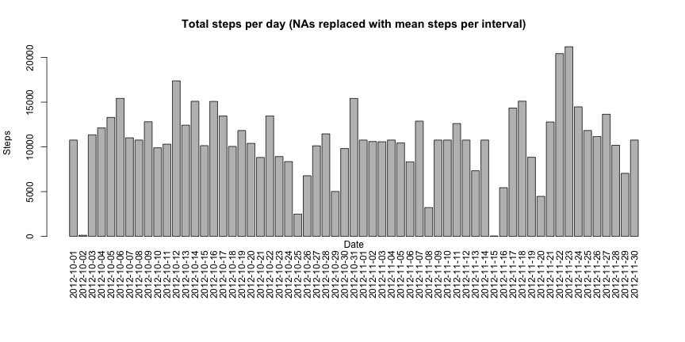

# Reproducible Research: Peer Assessment 1


## Loading and preprocessing the data


```r
setwd("~/Documents/Dev/Coursera/GitHub/RepData_PeerAssessment1")
unzip("activity.zip")
data <- read.csv("activity.csv", header=TRUE, na.strings = "NA")
data$steps <- as.numeric(data$steps)
data$date <- as.Date(data$date,"%Y-%m-%d")
data$interval <- as.numeric(data$interval)
```


## What is mean total number of steps taken per day?

```r
excludeNAs <- data[!is.na(data$steps),]
chartdata <- tapply(excludeNAs$steps, excludeNAs$date, FUN=sum)
par(las=3, mar = c(9,4,4,2) + 0.1)
barplot(chartdata, main="Total steps per day", xlab="", ylab="Steps")
title(xlab="Date",mgp=c(0,0,0)) 
```

 

```r
dataMelt <- melt(excludeNAs, id=c("date", "interval"))
totalSteps <- dcast(dataMelt, date ~ variable,  fun.aggregate = sum)
meanSteps <- mean(totalSteps$steps)
medianSteps <- median(totalSteps$steps)
```
The mean value of total steps is **10766.1887**.

The median value of total steps is **10765**.


## What is the average daily activity pattern?

```r
avgIntervalSteps <- dcast(dataMelt, interval ~ variable,  fun.aggregate = mean)
plot(avgIntervalSteps$interval, avgIntervalSteps$steps, type="l", main="Average Daily Activity Pattern", xlab="Interval", ylab="Average Steps")
```

 

```r
maxRow <- avgIntervalSteps[avgIntervalSteps$steps == max(avgIntervalSteps$steps),]
```
The interval with the maximum average steps is **835 (206.1698 steps)**.


## Imputing missing values

```r
nas <- data[is.na(data$steps),]
```
The number of rows with a missing steps value (NA) is **2304**.

The following code replaces missing steps values with the mean number of steps of the respective interval (mean calculation excludes NAs): 

```r
nasReplaced <- data
for(i in 1:nrow(nasReplaced)) {
    if (is.na(nasReplaced[i,1])) {
        nasReplaced[i,1] <- mean(excludeNAs[excludeNAs$interval == nasReplaced[i,3], 1])
    } 
}
nachartdata <- tapply(nasReplaced$steps, nasReplaced$date, FUN=sum)
par(las=3, mar = c(9,4,4,2) + 0.1)
barplot(nachartdata, main="Total steps per day (NAs replaced with mean steps per interval)", xlab="", ylab="Steps")
title(xlab="Date",mgp=c(0,0,0)) 
```

 

```r
nasDataMelt <- melt(nasReplaced, id=c("date", "interval"))
nasReplacedTotalSteps <- dcast(nasDataMelt, date ~ variable,  fun.aggregate = sum)
nasMeanSteps <- mean(nasReplacedTotalSteps$steps)
nasMedianSteps <- median(nasReplacedTotalSteps$steps)
```
The mean value of total steps (with NAs replaced with mean steps per interval) is **10766.1887**.

The median value of total steps (with NAs replaced with mean steps per interval) is **10766.1887**.

Observation: the *after* dataset (with NAs replaced) has mean equal to median.   


## Are there differences in activity patterns between weekdays and weekends?

```r
week <- data.frame(rep('weekday', nrow(nasReplaced)))
colnames(week) <- 'weekType'
week$weekType <- as.character(week$weekType)
for(w in 1:nrow(nasReplaced)) {
    if (weekdays(nasReplaced[w,2]) == 'Saturday' | weekdays(nasReplaced[w,2]) == 'Sunday') {
      week[w,1] <- 'weekend'
    } 
}
week$weekType <- as.factor(week$weekType)
combined <- cbind(nasReplaced, week)
weekDataMelt <- melt(combined, id=c("date", "interval", "weekType"))
avgWeekTypeSteps <- dcast(weekDataMelt, interval + weekType ~ variable,  fun.aggregate = mean)
xyplot(steps~interval|weekType, avgWeekTypeSteps, layout=(c(1,2)), type="l")
```

 
